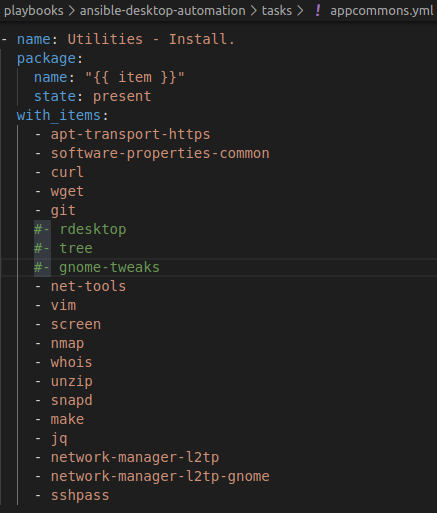
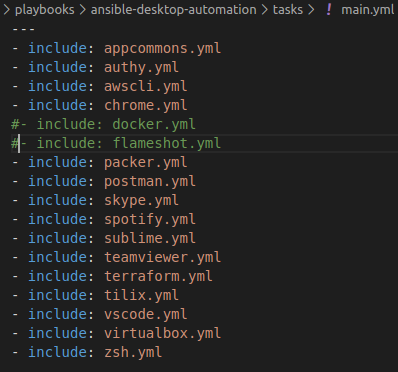
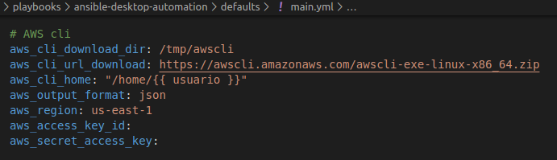
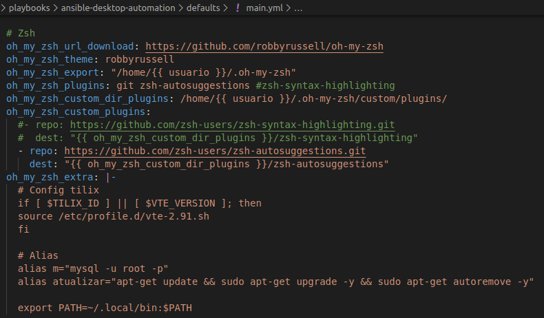

# ansible-desktop-automation

Gostaria de compartilhar uma receita em ansible, que provisiona uma maquina recém formatada. Criei essa receita, pois perco muito tempo instalando os programas toda vez que preciso formatar meu computador, além de esquecer de alguns programas.

Esse projeto em ansible faz a instalação de alguns pacotes de uso geral para quem trabalha com DevOps.

Obs: Não é necessário instalar o ansible, o script no final da página faz.

## Distribuições

Essa receita em ansible foi testado nos SOs listados abaixo:

* Ubuntu 18.04
* Ubuntu 20.04

## Lista de utilitários

Todos os utilitários listados abaixo serão instalados, esses utilitários estão no arquivo `tasks/appcommons.yml`. Caso não tenha interesse em instalar algum utilitário, basta comentar a linha. Caso tenha algum utilitário que é instalado usando o **apt-get**, basta incluir nesse arquivo.




## Lista de programas

Todos os programas listadas abaixo, tambem podem ser ignoradas na instalação, para isso basta comentar a linha do arquivo `tasks/main.yml`.




## Preparando instalação

 - Configurações gerais

 A versão de instalação de todos os programas estão setados no arquivo `defaults/main.yml`, caso queira utilizar uma versão diferente basta alterar.

 - Configuração AWS cli

 É possível antes da instalação já informar as chaves de acesso a API AWS, para isso, basta informar essas chaves no arquivo `defaults/main.yml`.



 - Configuração ZSH

 É possível adicionar novos plugins ao ZSH, novos temas e alias, para isso basta adicionar conforme mostrado abaixo no arquivo `defaults/main.yml`.



## Instalação

A instalação é feita através da execução do comando abaixo:

**SHELL**
```bash
wget -qO- https://raw.githubusercontent.com/leandrolanza/ansible-desktop-automation/master/install.sh | bash -
```


## Próximos passos

Essa receita não instala todas as ferramentas que utilizo e tambem não configura plugins, modulos, etc. Mas irei incluindo novos recursos para que a receita fique completa.